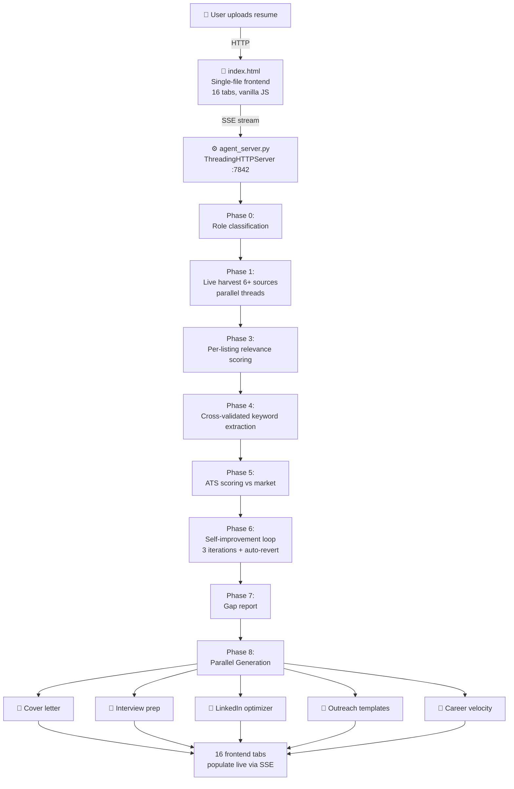

<div align="center">

# APEX

**The world's most sophisticated open-source resume intelligence agent.**

*One click. 16 tabs of analysis. Live job market data. ~18¢ per full optimization.*

[](https://python.org)
[](#tech-stack)
[](https://openai.com)
[](LICENSE)
[]()

[**Quick Start**](#quick-start) · [**Features**](#features) · [**Architecture**](#architecture) · [**Demo**](#demo) · [**FAQ**](#faq)

</div>

---

## Why APEX exists

Every paid resume tool — Jobscan ($49/mo), Rezi ($29/mo), Teal ($29/mo), Resume.io ($23/mo) — works the same way: score your resume against a static keyword database, charge a recurring subscription, repeat.

APEX is fundamentally different. It is a **local AI agent** that:

1. **Scrapes live job postings in real time** from JSearch, USAJobs, The Muse, Arbeitnow, Remotive, and Google News for your specific role and sector
2. **Runs a self-graded 3-iteration improvement loop** — each pass grades the previous one and auto-reverts if a change makes the resume worse
3. **Populates 16 analysis tabs from a single click** — market intelligence, gap report, cover letter, interview prep, LinkedIn optimizer, outreach scripts, salary negotiation brief, career velocity, and more
4. **Costs ~18¢ per full run** instead of $29/month forever

It runs entirely on your machine. Your resume never leaves your computer except for the API calls you authorize.


---

## Features

### 16 analysis tabs from one click

| Tab | What you get |
|---|---|
| **Market Intel** | Hot/warm/cold/emerging keywords, frequency bars, hard vs soft skills split, salary-premium skills |
| **Resume X-Ray** | Original vs 3-iteration optimized side-by-side, with keywords highlighted |
| **Gap Report** | Keyword status table, before/after rewrites, ATS score progression, recommendations |
| **Live Jobs** | Real openings from JSearch, The Muse, Arbeitnow, Remotive, USAJobs — with direct apply links |
| **Cover Letter** | AI-generated from live market data, exportable as PDF/DOCX/TXT |
| **Interview Prep** | Behavioral + technical Q&A in STAR format, smart questions to ask, salary negotiation tips |
| **LinkedIn** | Optimized headline (220 chars), About section (2000 chars), top 10 ranked skills |
| **Outreach** | LinkedIn DM, cold email, referral request, thank-you note, negotiation script |
| **Bullet Ranker** | Every bullet scored 0-100, weakest first, bottom 5 auto-rewritten |
| **Job Tailor** | Paste any posting → resume rewritten for THAT specific role with before/after match scores |
| **Smart Match** | Paste any posting → instant match %, missing keywords, quick fixes, green/red flags |
| **Negotiate** | Real salary target, opening counter, walk-away floor, word-for-word script |
| **Skills Bridge** | Career-changer translator: maps old role language to new role language |
| **Weakness X-Ray** | First-impression score, killer bullets identified, generic phrases flagged for deletion |
| **Career Velocity** | Trajectory vs peers, years to next level, market position, acceleration moves |
| **App Tracker** | Full pipeline tracking with response-rate calculation, saved in browser localStorage |

### Engineering features

- **Self-improvement loop** — 3 iterations, each self-grades the previous; auto-reverts on regression
- **28 industry sectors** — each with sector-specific scraping sources and keyword sources
- **Sector-aware routing** — healthcare uses USAJobs, tech uses RemoteOK, real estate uses Indeed, etc.
- **Market drift detection** — saves baseline ATS score, alerts when market shifts make your resume stale
- **Version history** — last 10 optimized resumes saved in localStorage with timestamps and scores
- **Cost tracker** — exact GPT-4o cost displayed live
- **Production-grade exports** — PDF (jsPDF), DOCX (docx.js), TXT — all with intelligent name extraction
- **Server-side health checks** — `/health` endpoint with version info and JSearch status
- **Full SSE streaming** — every agent step appears live as it happens, no waiting for final response

---

## Quick Start

```bash
# 1. Clone the repo
git clone https://github.com/YOUR_USERNAME/apex.git
cd apex

# 2. Set up your API keys (one-time)
cp config.example.json config.json
# Then edit config.json and add:
#   - Your OpenAI key (https://platform.openai.com/api-keys)
#   - Your JSearch key (https://rapidapi.com/letscrape-6bRBa3QguO5/api/jsearch)
# JSearch has a free tier — 200 requests/month, no credit card required

# 3. Start the agent server
python agent_server.py

# 4. Open the frontend in your browser
# macOS:
open index.html
# Windows:
start index.html
# Linux:
xdg-open index.html
```

That's it. **No npm install. No pip install. No Docker.** Pure Python 3.8+ stdlib + a single HTML file.

---

## Architecture



### The self-improvement loop

This is the core innovation no competitor has built:

```
Baseline Resume (self-graded against live market data)
  │
  ├─ Iteration 1: Inject all validated market keywords naturally
  │    Score improved? → KEEP this version as new baseline
  │
  ├─ Iteration 2: Quantify every achievement (add metrics)
  │    Score improved? → KEEP
  │    Score regressed? → REVERT to iteration 1
  │
  └─ Iteration 3: Improve readability and flow
       Score improved? → KEEP
       Same/worse? → Keep best previous

Final Resume = highest-scoring iteration, validated by the model itself
```

Other tools optimize once and stop with no way to know if the output is actually better. APEX validates every change against live market data and only keeps improvements.

For deeper architecture documentation, see [`docs/ARCHITECTURE.md`](docs/ARCHITECTURE.md).

---

## Tech stack

**Backend** — `agent_server.py` (1,769 lines)
- Pure Python 3.8+ stdlib: `http.server`, `urllib`, `json`, `threading`, `xml.etree`
- Zero pip packages required
- Threading-based parallel job harvest (8+ concurrent sources)
- Server-Sent Events (SSE) streaming for real-time updates
- 10 RESTful endpoints: `/analyze`, `/tailor`, `/bullets`, `/negotiate`, `/bridge`, `/match`, `/xray`, `/velocity`, `/drift`, `/health`, `/config`

**Frontend** — `index.html` (3,800+ lines)
- Zero framework — vanilla HTML/CSS/JavaScript
- Fonts: Plus Jakarta Sans (UI), Fira Code (mono)
- Fetch API + EventSource for SSE streaming
- localStorage for version history, application tracker, drift detection baseline
- pdf.js + mammoth.js loaded on-demand for PDF/DOCX upload parsing
- jsPDF + docx.js loaded on-demand for production-grade exports
- 16 tabs, fully responsive design with horizontal nav scroll

**External services**
- OpenAI GPT-4o for AI generation
- JSearch via RapidAPI for live job aggregation (Indeed, LinkedIn, Glassdoor)
- The Muse, Arbeitnow, Remotive, USAJobs (free public APIs, no key required)

---

## Cost breakdown

A full APEX run calls GPT-4o approximately 10 times:

| Phase | Calls | Approx cost |
|---|---|---|
| Role classification | 1 | ~1¢ |
| ATS analysis + scoring | 1 | ~4¢ |
| Self-improvement loop (×3) | 3 | ~9¢ |
| Parallel generators (cover, interview, LinkedIn, outreach, velocity) | 5 | ~8¢ |
| **Total per run** | **~10 calls** | **~18-22¢** |

Compared to Jobscan at $29/month, APEX pays for itself after the first run if you use it more than once.

---

## API keys

### OpenAI
Used for all AI generation. Get a key at [platform.openai.com/api-keys](https://platform.openai.com/api-keys). Set a monthly spending limit in your account settings — APEX never exceeds ~25¢ per run, but spending limits are good practice.

### JSearch (RapidAPI)
Used to scrape live job postings from Indeed, LinkedIn, Glassdoor, ZipRecruiter, and 20+ more boards via a single API. Get a key at [rapidapi.com/letscrape-6bRBa3QguO5/api/jsearch](https://rapidapi.com/letscrape-6bRBa3QguO5/api/jsearch).

The free tier (200 requests/month) is enough for regular use. Even without JSearch, APEX falls back to Arbeitnow, Google News RSS, USAJobs, The Muse, and Remotive — all free, all no-key-required.

---

## Security

⚠️ **Never commit `config.json`** — it contains your API keys. The `.gitignore` in this repo excludes it automatically.

If you accidentally commit API keys, immediately revoke them at the source (OpenAI dashboard / RapidAPI dashboard) and generate new ones. Consider any key that has appeared in a public repo, public chat, or public log to be permanently compromised.

---

## File structure

```
apex/
├── agent_server.py          # Python backend — 1,769 lines, all AI logic
├── index.html               # Complete frontend — 3,800+ lines, 16 tabs
├── config.example.json      # Template — copy this to config.json
├── requirements.txt         # No pip packages needed (stdlib only)
├── README.md                # This file
├── LICENSE                  # MIT
├── CONTRIBUTING.md          # How to contribute
├── CHANGELOG.md             # Version history
├── .gitignore               # Excludes config.json, __pycache__, etc.
├── docs/
│   ├── ARCHITECTURE.md      # Deep dive on the agent's internals
│   ├── API.md               # All 10 endpoints documented
│   └── DESIGN.md            # Why the UI/UX is the way it is
├── assets/
│   └── sample-export.pdf    # Example output for verification
└── .github/
    └── ISSUE_TEMPLATE/
        ├── bug_report.md
        └── feature_request.md
```

---

## Roadmap

**Shipped (v1.0)**
- 16 analysis tabs, 8-phase agent loop, self-improvement loop
- 28 industry sectors with sector-specific source routing
- Live job market scraping (6+ sources)
- Production-grade PDF/DOCX/TXT exports
- localStorage-backed version history, app tracker, drift detection

**Coming next**
- [ ] Server migration from `http.server` → FastAPI for production scale
- [ ] Multi-user mode with auth (Clerk) and database (Supabase)
- [ ] Stripe billing integration for hosted version
- [ ] Browser extension that captures job postings as you browse
- [ ] LinkedIn profile scraper (with explicit user authorization)
- [ ] Salary benchmark database with city-level granularity
- [ ] Mobile app (React Native, sharing the same backend)

---

## How to record the demo

Once you have APEX running locally:

1. Run a full optimization on a real resume
2. Use [Kap](https://getkap.co/) (macOS) or [ScreenToGif](https://www.screentogif.com/) (Windows) or `peek` (Linux) to record a 30-60 second clip showing:
   - Upload + click Launch Agent
   - The 8 phases firing through the log
   - Tabs populating live
   - Switching through 3-4 tabs
   - Click Export PDF
3. Save as `assets/demo.gif` (keep under 10MB — 800px wide, 24fps is plenty)
4. In this README, replace the demo block with: ``

---

## Contributing

Contributions are welcome — see [CONTRIBUTING.md](CONTRIBUTING.md). Good first issues are tagged in the [Issues](../../issues) tab.

If APEX helps you land a job, [tell me about it](../../discussions) — these stories make the project worth the work.

---

## License

[MIT](LICENSE) — use it, fork it, build on it, ship it. Attribution appreciated but not required.

---

## Acknowledgments

Built with:
- [OpenAI GPT-4o](https://openai.com) — AI reasoning and generation
- [JSearch / RapidAPI](https://rapidapi.com/letscrape-6bRBa3QguO5/api/jsearch) — Live job aggregation
- [pdf.js](https://mozilla.github.io/pdf.js/) — In-browser PDF parsing
- [mammoth.js](https://github.com/mwilliamson/mammoth.js) — In-browser DOCX parsing
- [jsPDF](https://github.com/parallax/jsPDF) — PDF generation
- [docx](https://github.com/dolanmiu/docx) — DOCX generation

---

<div align="center">

**If APEX helped you, leave a ⭐**
*It costs nothing and tells me to keep building.*

</div>
